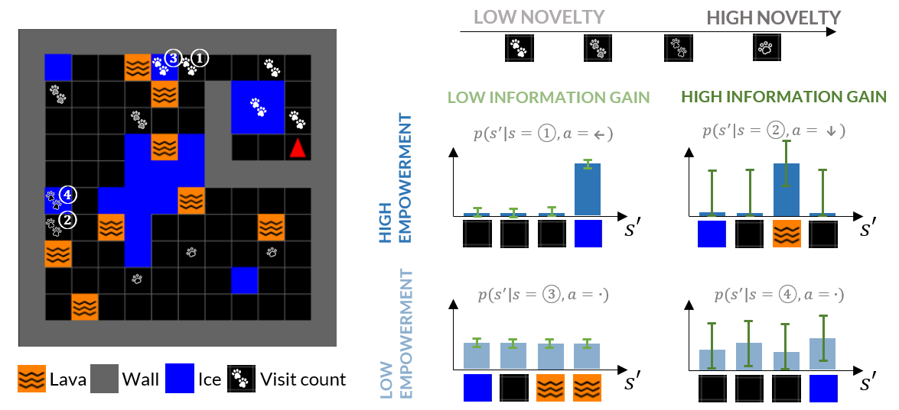
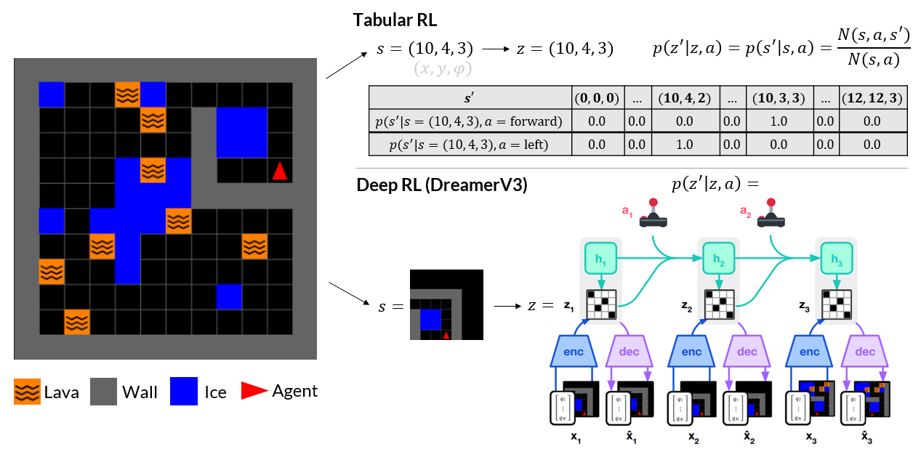

# From Curiosity to Competence: How World Models Interact with the Dynamics of Exploration

This repository contains the official code and experiments for the paper **"From Curiosity to Competence: How World Models Interact with the Dynamics of Exploration"** (Mantiuk, Zhou, & Wu, 2025).

## Overview

Our experiments use a custom MiniGrid environment with three tile types that aim to disentangle key differences between striving for curiosity vs. competence. It features:
-   **Ice tiles**: Induce stochastic transitions (the agent slips).
-   **Lava tiles**: Are fatal and terminate the episode.
-   **Bottleneck layout**: Requires directed exploration to navigate successfully.



*Figure: The mixed-state playground environment, plus a schematic illustrating how different intrinsic motivations respond to each tile type. __Knowledge-seeking:__ Novelty is high for infrequently visited states, Information Gain is similarly high for transitions the agent cannot accurately predict yet. __Competence-seeking:__ Empowerment is high in states from which many other states can be controllably reached.*

In this environment, we compare two fundamentally different approaches to learning and representing the environment:



### Tabular Agent
- **State representation**: Fixed `(x, y, orientation)` tuples
- **Model**: Count-based transition dynamics
- **Advantages**: Exact computation of intrinsic rewards, interpretable

### Dreamer Agent  
- **State representation**: Learned discrete latent space (32 factors × 32 categories)
- **Model**: Neural network world model with encoder/dynamics predictor
- **Advantages**: Generalization, semantic understanding, scales to complex environments

## Repository Structure
-   `exp/`: Jupyter notebooks containing early experiments as well as the main experiments and analysis code for the paper.
    -   `exp003`: **Tabular Agent** experiments (Simulation 1 in the paper).
    -   `exp004`: **Dreamer Agent** experiments (Simulation 2 in the paper).
-   `src/`: Core Python source code written for this project, primarily for the Tabular agent and utility functions.
-   `world_model/`: The modified **DreamerV3** implementation, which forms the basis for our Dreamer agent experiments.
-   `fig/`: Plots and visualizations generated for the paper.

## Running Experiments

### 1. Tabular Agent Experiments

The Tabular agent uses a simplified state representation `(x, y, orientation)` and a model-based Q-learning approach with prioritized sweeping.

**To run a single experiment:**
The experiments are launched via `run_single_agent.py`. For example:
```bash
# Assumes you are in the root directory of the repository
python3 src/run_single_agent.py --rewards empowerment --gamma 0.999 --seed 42
```
*   Available rewards: `novelty`, `information_gain`, `empowerment`, and their combinations `mean` or `product`.

**To reproduce all tabular results (HPC Example):**
Our paper's results were generated on a SLURM cluster. The following scripts automate this process:
```bash
# 1. Generate job scripts for all parameter combinations (may need to adapt run params in generate_job_scripts.py)
python src/generate_job_scripts.py

# 2. Submit all jobs to the cluster
./submit_all.sh
```
*   After the runs complete, the analysis and plots can be generated using the code in `exp/exp003_TrainIntrinsicAgentInMiniGrid.ipynb`.

### 2. Dreamer Agent Experiments

The Dreamer agent learns a latent representation of the world from raw pixel observations using a modified DreamerV3 architecture.

**Setup:**
```bash
cd world_model/
pip install -r requirements.txt
```

**To run a single experiment:**
1.  Modify the configuration file `world_model/dreamerv3/configs.yaml`. For example, to run an empowerment-driven agent, you could set the `minigrid-pretrain-mixedenv` config:
    ```yaml
    latents_intrinsic: 'latentsempowerment'
    ignore_extr_reward: True
    ```
2.  Run the training script from the `world_model/` directory:
    ```bash
    python -m dreamerv3.run --configs minigrid-pretrain-mixedenv --logdir ./logs/empowerment_run_1
    ```
*   Available intrinsic motivations: `latentsnoveltyperstatefactorized` (the factorized implementtion of novelty used in the final experiments), `latentsinformationgain`, `latentsempowerment`.
*   The analysis and plots can be generated using the code in `exp/exp004_TrainIntrinsicAgentInMiniGridWithDreamer.ipynb`.

## External Code

This project builds upon the excellent work of others.
-   **DreamerV3 Base:** Our `world_model/` is a modification of the implementation from [Ferrao & Cunha (2025)](https://github.com/Jazhyc/world-model-policy-transfer), which itself is based on the [original DreamerV3](https://github.com/danijar/dreamerv3).
    -   **Our Core Contributions:** We implemented novel, information gain, and empowerment intrinsic rewards within the latent space of this model. The main logic for these can be found in `world_model/dreamerv3/embodied/core/driver.py`.
    
## Citation

If you find this work useful, please cite our paper and/or my thesis:
```bibtex
@inproceedings{mantiuk2025fromcuriosity,
  title={From Curiosity to Competence: How World Models Interact with the Dynamics of Exploration},
  author={Mantiuk, Fryderyk and Zhou, Hanqi and Wu, Charley M},
  booktitle={Proceedings of the 47th Annual Meeting of the Cognitive Science Society},
  year={2025}
}
```

## License
This repository is licensed under the MIT License. See the [LICENSE](LICENSE) file for details.